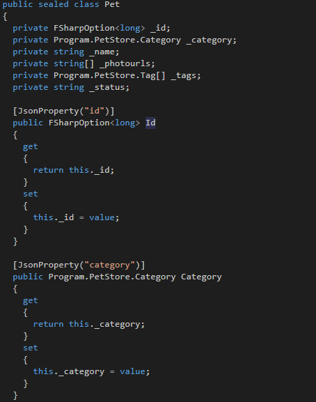

- title : The marvels of F# type providers
- description : A dive into the world of F# type providers
- author : Alexander Mogilka
- theme : moon
- transition : default

***
## The marvels of F# type providers
<br />
Alexander Mogilka
<br />
[@alxmglk](http://www.twitter.com/alxmglk)

***
## The era of rich information spaces


<small>Most modern systems integrate with a bunch of external information sources</small>

***
## Adapters for an external data source
* hand-written static library
* generated static library
* dynamically-typed information representation

***
## The traditional bridging mechanisms are deficient
* hand-written libraries do not scale to information spaces with large metadata-size
* workflows involving code generation are clumsy and do not integrate well with exploratory programming
* dynamically-typed bridging mechanisms discard the benefits of strongly-typed programming

***
## Type provider is a cure
A compiler plugin with access to the external world that augments the set of types that are known to the type-checker and compiler.

***
## Type provider mechanics


***
## The benefits of type provider
* scales to information sources with large quantities of metadata
* seamless integration with development tools
* enables the use of code completion and interactive type checking
* open architecture

***
## Type providers in the wild

Let's see how some of the most popular type providers could be used in the real life

***
## Json Provider
    open FSharp.Data

    type People = JsonProvider<""" 
        [ 
            { "name":"John", "age":94 }, 
            { "name":"Tomas" } 
        ] """>

    for item in People.GetSamples() do 
        printf "%s " item.Name
        item.Age |> Option.iter (printf "(%d)")
        printfn ""
    // John (94)
    // Tomas

[https://github.com/fsharp/FSharp.Data](https://github.com/fsharp/FSharp.Data)

***
## Json Provider is an erasing provider 
#### It doesn't really create any new types in the output assembly

    // in reality each json object gets converted into IJsonDocument
    JsonRuntime.ConvertArray<IJsonDocument>(
        JsonDocument.Create(new StringReader(inputJson), "")
    )

    // and calls to the properties look like this
    JsonRuntime.ConvertInteger("", 
        JsonRuntime.TryGetPropertyUnpacked(jsonDocument, "age")
    )

***
## Sql Client Provider
    open FSharp.Data

    [<Literal>]
    let designConnectionString = 
        "Data Source=.;Initial Catalog=AW2012;Integrated Security=True"
    
    type GetTopSellers = SqlCommandProvider<"
        SELECT TOP(@topN) FirstName, LastName, SalesYTD 
        FROM Sales.vSalesPerson
        WHERE CountryRegionName = @regionName AND SalesYTD > @salesMoreThan 
        ORDER BY SalesYTD", designConnectionString>

    use query = new GetTopSellers(runtimeConnectionString)
    query.Execute(topN = 2L, 
        regionName = "United States", 
        salesMoreThan = 1000000M) |> printfn "%A"
    // [("Pamela", "Ansman-Wolfe", 1352577.1325M); 
    //  ("Tete", "Mensa-Annan", 1576562.1966M)]

[https://github.com/fsprojects/FSharp.Data.SqlClient](https://github.com/fsprojects/FSharp.Data.SqlClient)

***
## Sql Client Provider Internals
* it uses a special system procedure to retrieve metadata of query result

    ```
    use cmd = new SqlCommand("sys.sp_describe_undeclared_parameters", 
        connection, 
        CommandType = CommandType.StoredProcedure)
    cmd.Parameters.AddWithValue("@tsql", commandText)
    ```
* it's an erasing type provider so under the hood we have only ADO.NET classes along with a few custom wrappers

***
## Swagger Provider
    open SwaggerProvider

    [<Literal>]
    let schema = "http://petstore.swagger.io/v2/swagger.json"
    type PetStore = SwaggerProvider<schema> // Provided Types

    let store = PetStore(runtimeHost) // Instance for communication

    let taggedPets = store.FindPetsByTags([|"tag1"|])

    let pet = new PetStore.Pet(Name = "foo", Status <- "sold")
    store.AddPet(pet)

[https://github.com/fsprojects/SwaggerProvider](https://github.com/fsprojects/SwaggerProvider)

***
## Swagger Provider is a generative type provider



#### The static model is put into the output assembly so it could be consumed from any .NET language

***
## How about .Net Core support?
As it stands only erasing type providers are currently supported starting from .NET Core 2.0

And only the providers from `FSharp.Data` package are available for usage (with some trickery)

***
## Creating a type provider

---
### Implement ITypeProvider interface
    interface ITypeProvider
    {
        /// Get the namespaces provided by this type provider.
        IProvidedNamespace[] GetNamespaces();
        /// Get the static parameters for a provided type.
        ParameterInfo[] GetStaticParameters(Type typeWithoutArguments);
        /// Apply static arguments to a provided type.
        Type ApplyStaticArguments(Type typeWithoutArguments, 
            string[] typePathWithArguments, 
            object[] staticArguments);
        /// Get the implementation of a call to a provided method.
        Expr GetInvokerExpression(MethodBase syntheticMethodBase, 
            Expr[] parameters);
        /// Get the physical contents of the generated provided
        /// assembly.
        byte[] GetGeneratedAssemblyContents(Assembly assembly);
        event System.EventHandler Invalidate;
    }
#### Looks scary, isn't it?

---
### Solution: TypeProviders StarterPack

There is `FSharp.TypeProviders.StarterPack` package which provides the basic implementation of the type provider for namespaces.

Unfortunately this package isn't suitable for .Net Core projects so the only resort for now is to reference the files via Paket or just include them manually.

[https://github.com/fsprojects/FSharp.TypeProviders.StarterPack](https://github.com/fsprojects/FSharp.TypeProviders.StarterPack)

---
### Inherit from TypeProviderForNamespaces
    open ProviderImplementation
    open ProviderImplementation.ProvidedTypes
    open Microsoft.FSharp.Core.CompilerServices

    [<TypeProvider>]
    type CustomProvider (config : TypeProviderConfig) as this =
        inherit TypeProviderForNamespaces ()

        let ns = "MyNamespace.Provided"

        let createTypes() =
            // build provided types based on data source metadata
            // implementation is omitted for the sake of brevity

        do
            // add namespace with provided types
            this.AddNamespace(ns, createTypes())
            
---
### Use Code Quotations
    let addI i = <@@ 1 + (%%i) @@>
    // val add2 : Expr = Call (None, op_Addition, [Value (1), Value (2)])
    let add2 = addI <@@ 2 @@>
    // val add2MultipliedByX : x:int -> Expr
    let add2MultipliedByX x = addI <@@ 2 * x @@>

#### This feature lets you generate an abstract syntax tree that represents F# code

---
### Dont't forget to mark the type provider assembly

The assembly which exposes type provider should be marked with the following attribute to make the provider discoverable by a compiler

    [<assembly:TypeProviderAssembly>]

***
## Demo
#### Build a dummy erasing type provider for .NET Core 2.0

***
## Conclusion
* type providers is a killer feature which surely augments the capabilities of F# and gives us a neat approach for consuming various information sources
* a big obstacle for the further development is a poor support of the type providers on .Net Core

***
## Questions?

***
## Useful links
* https://www.microsoft.com/en-us/research/wp-content/uploads/2016/02/information-rich-themes-v4.pdf
* http://blog.mavnn.co.uk/type-providers-from-the-ground-up/
* https://github.com/Microsoft/visualfsharp/issues/3303
* "F# Design Patterns" by Gene Belitski (the chapter dedicated to type providers)