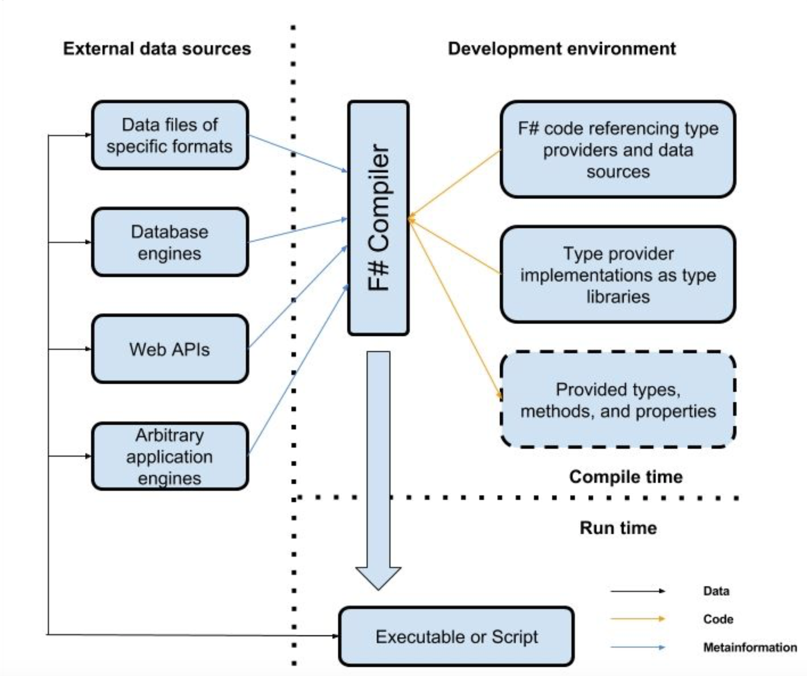

- title : The marvels of F# type providers
- description : A dive into the world of F# type providers
- author : Alexander Mogilka
- theme : moon
- transition : default

***
## The marvels of F# type providers
 
Alexander Mogilka
 
[@alxmglk](http://www.twitter.com/alxmglk)

***
## The era of rich information spaces

<small>Most modern systems integrate with a bunch of external information sources</small>

***
## Adapters for an external data source
* hand-written static library
* generated static library
* dynamically-typed information representation

***
## The traditional bridging mechanisms are deficient
* hand-written libraries do not scale to information spaces with large metadata-size
* workflows involving code generation are clumsy and do not integrate well with explorative programming
* dynamically-typed bridging mechanisms discard the benefits of strongly-typed programming

***
## Type provider is a cure
A compiler plugin with access to the external world that augments the set of types that are known to the type-checker and compiler.

***
## Type provider mechanics

***
## The benefits of type provider
* scales to information sources with large quantities of metadata
* seamless integration with development tools
* enables the use of code completion and interactive type checking
* open architecture
